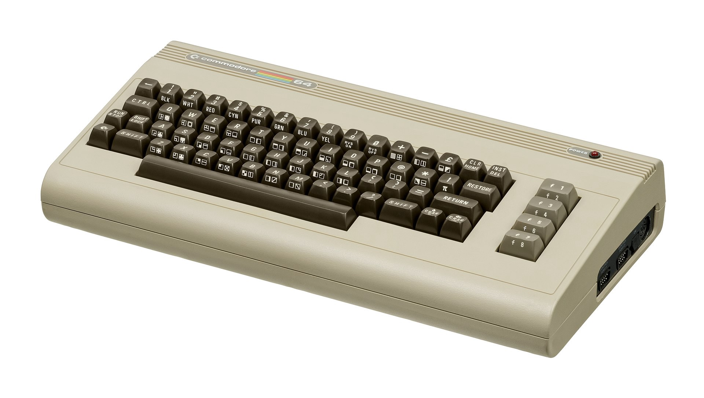
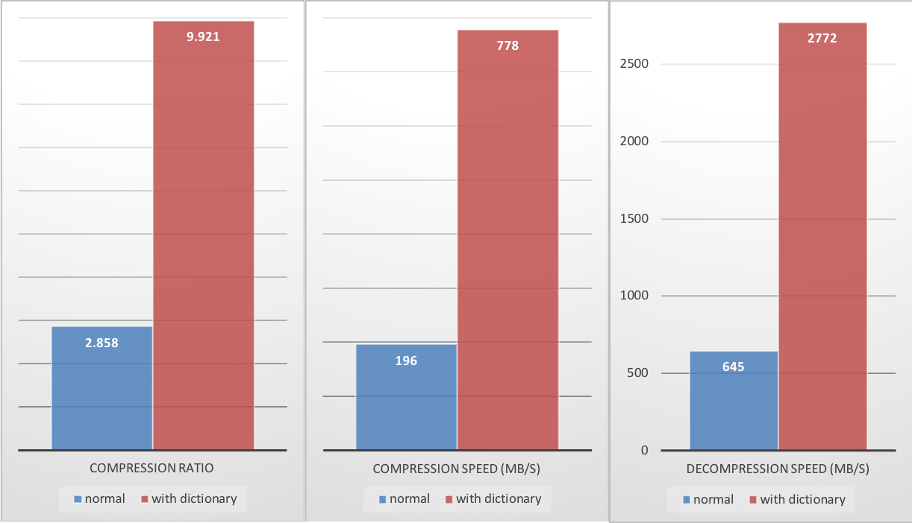
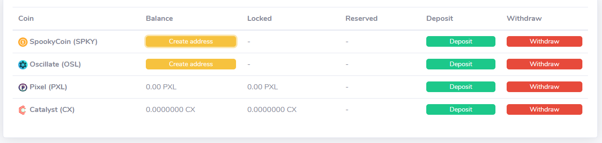
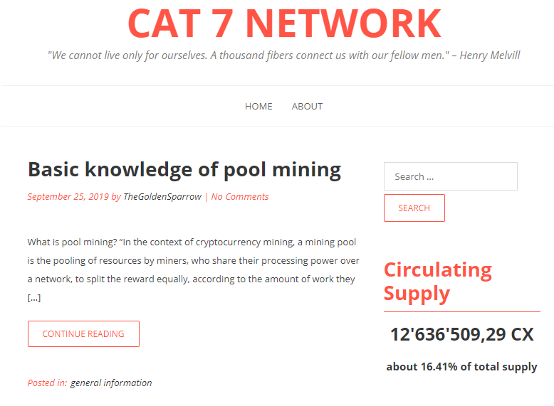
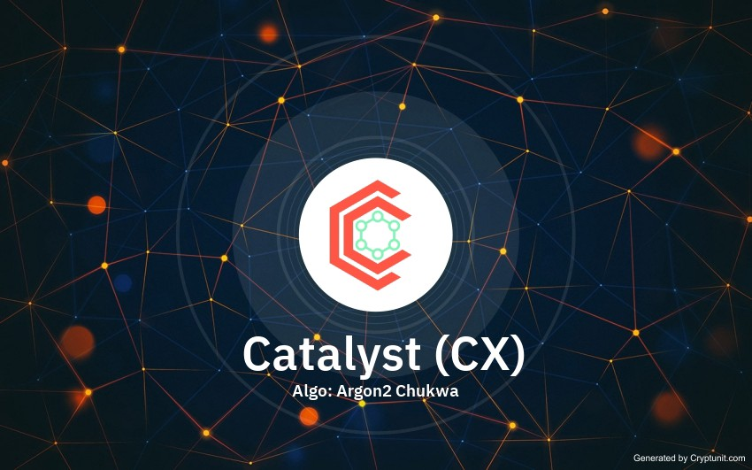
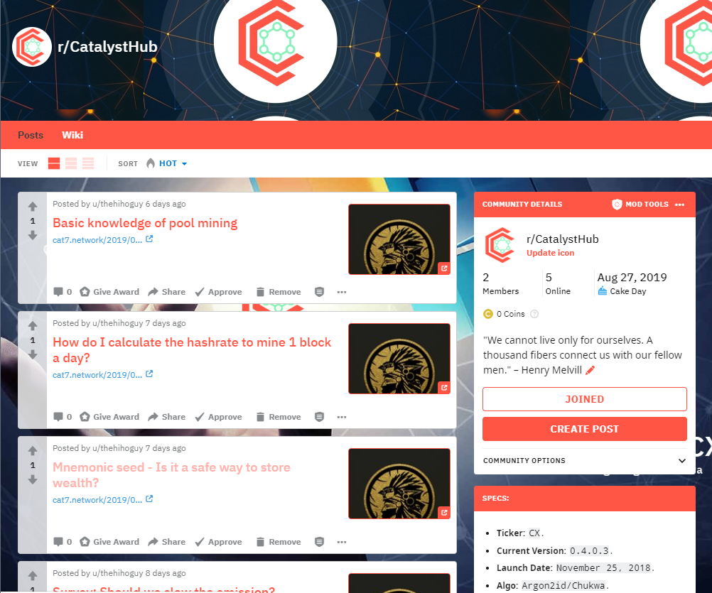
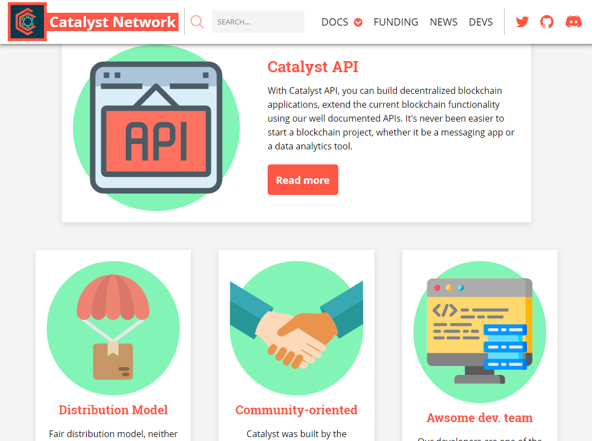
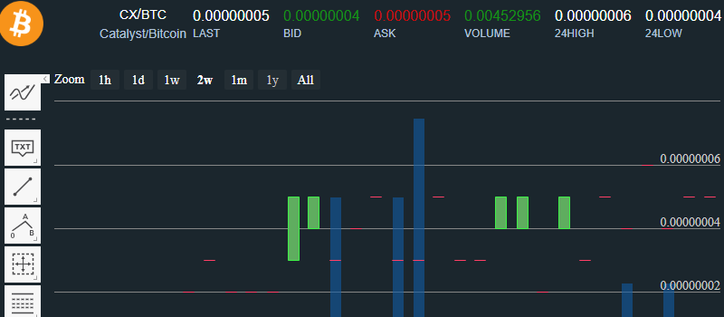
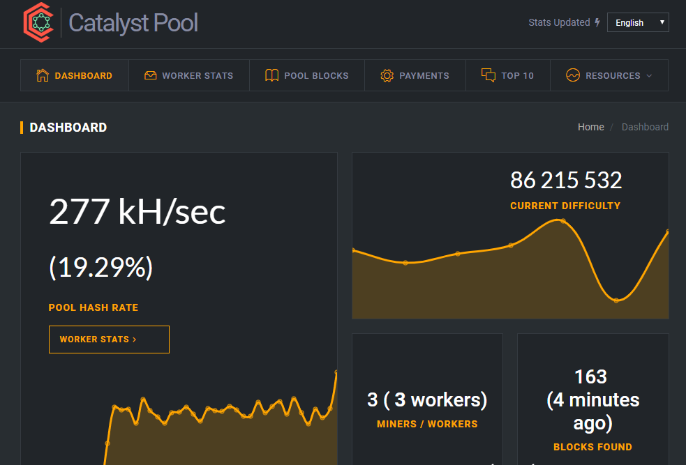

	
Since I was a kid, I’ve had a great passion for computers and tech in general, but I understood pretty early on that if you want these things you need money. So I started to save up for my first computer; a Commodore 64.

Almost every kid I knew dreamed about it. Long story short, at some point I decided to stash the paper money I’d managed to gather over time for safekeeping. As a 5 y.o. boy, I thought it would be more secure buried under the tree in our garden. Imagine my disappointment, when after a while, I found my entire fortune destroyed by humidity and rains. I’m telling you this story because even nowadays when you think everyone is smarter than ever, most people still store their wealth in paper currency or banks, and considering all we know now, it’s equivalent to just burying it under the tree in the hopes that it’ll be safe there, but it’s not, this is why the advent of cryptocurrency was inevitable, and this is why the world is going to change to a degree you wouldn’t even imagine, and we as the Catalyst Network are going to become an integral part of this global sea change!

So, let’s roll, this is a long-awaited article that I have long wanted to write, but you know how it is, there are always so many things to do and the time is limited, there is a Hebrew saying:

>לַכֹּל זְמָן וְעֵת לְכָל-חֵפֶץ תַּחַת הַשָּׁמָיִם   
עֵת לָלֶדֶת וְעֵת לָמוּת עֵת לָטַעַת וְעֵת לַעֲקוֹר נָטוּע  
עֵת לַהֲרוֹג וְעֵת לִרְפּוֹא עֵת לִפְרוֹץ וְעֵת לִבְנוֹת  
עֵת לִבְכּוֹת וְעֵת לִשְׂחוֹק עֵת סְפוֹד וְעֵת רְקוֹד  
עֵת לְהַשְׁלִיךְ אֲבָנִים וְעֵת כְּנוֹס אֲבָנִים עֵת לַחֲבוֹק וְעֵת לִרְחֹק מֵחַבֵּק  
עֵת לְבַקֵּשׁ וְעֵת לְאַבֵּד עֵת לִשְׁמוֹר וְעֵת לְהַשְׁלִיךְ  
עֵת לִקְרוֹעַ וְעֵת לִתְפּוֹר עֵת לַחֲשׁוֹת וְעֵת לְדַבֵּר  
עֵת לֶאֱהֹב וְעֵת לִשְׂנֹא עֵת מִלְחָמָה וְעֵת שָׁלוֹם  
>
>To everything there is a season and a time to every purpose under the heaven:  
A time to be born, and a time to die; a time to plant, and a time to pluck up that which is planted;  
A time to kill, and a time to heal; a time to break down, and a time to build up;  
A time to weep, and a time to laugh; a time to mourn, and a time to dance;  
A time to cast away stones, and a time to gather stones together; a time to embrace, and a time to refrain from embracing;  
A time to get, and a time to lose; a time to keep, and a time to cast away;  
A time to rend, and a time to sew; a time to keep silence, and a time to speak;  
A time to love, and a time to hate; a time of war, and a time of peace.

So let’s not waste time and get straight to the deal.

## Discussion about slowing the emission.

@TheGoldenSparrow. Suggested that we think about the emission rate. Currently, miners get around 15 CX for each block they find. Do you think this is too much? By simple calculation, we can deduce that 15×60×24=21600 CX are generated each day, it’s about 21600×365 = 7884000 — so almost 8 million new coins each year. In my humble opinion, this is a bit too much, so I think we should slow the emission, to 2 million coins a year, for Catalyst to last, and so we won’t mine all the coins in the first decade.

We can also remove the emission curve model, and make the reward constant, and then just halve it every couple of years. There are a lot of options that could be done, for example, we can increase the block time to 2 minutes, this will bring the annual emission to 4 million coins.

What do you think? Please take a [vote](https://www.cat7.network/2019/09/23/survey/survey-should-we-slow-the-emission/ "vote") here, and tell us your opinion on the [discord](https://discord.gg/Wf8hsBU "discord").

## Discussion about pruning.

Pruning is the process of removing non-critical blockchain information from local storage. Full nodes keep an entire copy of everything that is stored on the blockchain, including data that is not very useful anymore. Pruned nodes remove much of this less relevant information to have a lighter footprint. Of course, running a full node is always better; however, pruned nodes have most of the important information and can still support the network.

For Bitcoin, many people discuss pruning in the context of intermediary transactions. For example, suppose Alice sends Bob 1 BTC, and then Bob sends this to Charlie. The blockchain would record records of transactions A -> B and B -> C. However, since Alice can no longer spend her funds, it’s less important to retain this information. Therefore, nodes can prune this information with a relatively high level of safety. Other nodes on the network would step in if something malicious occurs.

This above example does not apply to Catalyst since we do not know when money is spent. However, Catalyst nodes can prune a lot of other unnecessary information. This includes ring signature data that isn’t essential to prevent double-spends. Pruned nodes can successfully remove approximately 2/3 of the total blockchain. So we will probably implement this feature somewhere down the road, but do not expect it to happen soon. Though considering our fellow developer Hooftly from AmityCoin is working on it already for his project, it’s a good sign.

## Discussion about the dynamic fee.

Currently, we are using the minimum transaction fee formula so our minimal fee is 10000 atomic units (.001CX), it’s up to the user if he wants to set a bigger fee so his transaction will be processed faster by the daemons, and transactions cheaper than the minimum transaction fee wouldn’t be accepted by daemons.

At the moment, it’s not an issue because there are not that much of the transactions going on in the network, and they are all processed almost immediately. Theoretically, we can even set the fee to zero but it can lead to transaction flooding.

Also, we can do something better by introducing the dynamic fee, this way if the user sends a big amount of CX the fee will be automatically calculated so daemons will process it as fast as possible. It will also help us later, as we plan to introduce messaging into our blockchain, the dynamic fee will calculate how much you’ll need to pay to send the message. Depending on data size and amount of coins the fee will be dynamically determined and optional if you pay over the average you get higher priority in being processed.

Our fellow developer from **`BTCMZ`**, Bobbie, is implementing this feature so it will be relatively easy for us to port it to Catalyst.

## Discussion about replacing the compression algorithm by zstd.

Currently, we are using lz4 compression algorithm to minimize the size of the blockchain database, it’s a good algo, but zstd will give us a better compression ratio, allowing us to reduce the overall size of the blockchain.

**Zstandard** (or **zstd**) is a 
[lossless data compression](https://en.wikipedia.org/wiki/Data_compression "lossless data compression") 
algorithm developed by 
[Yann Collet](https://twitter.com/cyan4973 "Yann Collet") at Facebook.

Looking at these charts, we can conclude that with the right dictionary, it will be possible to decrease our blockchain size drastically.

## Discussion about the static difficulty for mining.

Our fellow member @Rachel was curious about the static and dynamic difficulty to adjust her miner for better performance.

In general, the difficulty is not very important. With recent research you can use automatic diff, at least on nodejs-pool based pools.

It’s usually good if a miner submits a few shares every minute. More often increases load on the pool, but gives more precise hash rate on the poolside statistics (without big peaks), and the overall hash rate stays the same.

Example: your hash rate is 10 KH/s this is 600000 (10000 * 60) hashes per minute, so with 100% effort you will be finding 1 share each minute, in reality, you can find 2+ shares per minute or zero, but on long enough time scales it doesn’t matter.

With diff 10000 you will find shares about each second, which is bad for the pool.

Also, 600000 difficulty is okay as well for 100 H/s worker, they will be finding share about every 100 minutes, for miners without keep-alive support it’s a very useful custom diff to prevent timeouts. You will just get credit on the block you managed to find that share on. The much bigger chunk of the payout.

## New web wallet.

We are now listed on the 
[SpookyPool web wallet](https://spookypool.nl/ "web wallet"), 
so miners can mine directly to this web wallet and then withdraw to exchanges. This will help people who don’t want to deal with CLI wallets and blockchain sync.

## [The new server proposal.](https://funding.cryptocatalyst.net/proposal/9 "server proposal")

For future development, we needed a stronger server,
so as a community we needed to come for some sort of agreement on this issue! We couldn’t continue further development, without at least one strong server at our disposal. Likely a member of our community @TheGoldenSparrow donated a sufficient amount of ETH to buy 4 core 8Gb of ram server, that will suit Catalyst’s needs for the foreseeable future.

## [New blog about Catalyst (Cat 7).](https://www.cat7.network/ "Cat 7")

One of our community members the @TheGoldenSparrow. Created a blog about Catalyst Network, where you can learn about the project and get some cool insights about blockchain technical concepts.

## Catalyst wallpapers.

Now you can get amazing wallpapers with the Catalyst logo for your mobile device at 
[www.cat7.network,](https://www.cat7.network/2019/09/14/general_information/mobile-wallpaper/ "Cat 7")

or desktop at [www.cryptunit.com.](https://www.cryptunit.com/coin/CX "cryptunit")

## Reddit redesign.

We redesigned our 
[Reddit hub](https://www.reddit.com/r/CatalystHub/ "Reddit hub") 
by adding a Catalyst flavor to it and filling it with content. Feel free to join it and take part in the community life by asking questions and sharing your thoughts.

## [The website proposal.](https://funding.cryptocatalyst.net/proposal/7 "website proposal")

Why we need a new website you may ask?

Because currently, our site is just a generic clone of the **`Conceal`** coin site.
I think Catalyst as a community needs a unique site that will host under its umbrella all the things we represent, and it will look attractive for exchanges and future investors.

You can read about the site requirements on the 
[proposal page](https://funding.cryptocatalyst.net/proposal/7 "website proposal") 
. 80K CX was raised and the work is already in action.

## Market Analysis: 

There is not much changed from the last review, though we are negotiating the listing on `CITEX`, this might change the picture, but don’t get your hopes high, because it’s in early stages, and we have some disagreements on the listing terms.

>Also, someone asked on the community forum, what the hell is Catalyst and what is it good for, does it has any use currently?

Well, Catalyst was created as a platform to create various services, like cheap, fast and secure payments, automated market analysis tools, secure messaging and many other useful decentralized applications.

But for these things to happen we need time and good developers, thus the funding system was created, to allow community members to propose services and get paid for implementing them. Consider it as one of the use cases for CX. You buy CX on exchanges or mine it and then donate to the projects and ideas you believe in, by this act, you are taking a part in the project’s growth and development, making Catalyst useful and more demanded.

## New Pool.

We are launching 2 new pools this week on our new powerful server, one for CX only mining, and one merged with BTCMZ, 
though the latest one is currently down due to BTCMZ network issues, once fixed, we will bring it up. 
Currently you can distribute your hash to 
[cx-pool.gq](https://cx-pool.gq/ "cx-pool.gq") 

## Triple mining CX+BTCMZ+NINJA (CX+BTCMZ+TURTL)

I was talking with **Campurro**, the owner of the **minercountry.com** 
and the author of the **triple merged mining pool**, and he is ready 
to make a pool for us to mine **CX** with **BTCMZ** and **NinjaCoin**.

> What I’m afraid of is that this will concentrate all the hashrate on one pool, and our chain will become unstable.

The best scenario would’ve been if **Campurro** shares the code, so we could launch our own pools with 3 coins mining to destribute the hash, but he is not yet ready to release the source.

Thus, we need to think! Do we want the pool like this, running on closed software and owning 90% of our hash? **Campurro is a nice guy**, and he is not going to invade **CX** unless we are ready for it. so what do you think?

> We can ask him to launch a pool and set a high fee like 20% which will go to dev fund, so only people who really support the project will mine on it?

## Community.

Our community is constantly getting bigger, this week we are welcoming 5 new members 
**Brendyn**, **erohal2000**, **QCTLG**, **Rogerrobers** and **xav**, we want to thank you guys for taking active participation in Catalyst’s life!

## Fun Facts.

Recently I caught **WitcherR** seducing other cryptonote coin owners to change their algo to chukka, though I have to admit that for cn-pico and cn-lite coins, if they want to change the algo, CHUKWA is the best option right now. we’ve forked like a month ago and had 0 issues with it, it brought us roughly 1.5M/H of additional hash rate, and a lot of small miners, so the network became more secure and stable.

As it turns out our new member **Brendyn** is a big fan of microcontrollers and DIY stuff, he did some benchmarks for Catalyst on different low power devices:

1. **Samsung Galaxy S8 Active:** 2120 h/s (8 available threads)
2. **Samsung Galaxy S5:** 760 h/s (4 available threads)
3. **Kindle Fire 7':** 192 h/s (3 available threads)

If you have any questions about launching the miner on a raspberryPi, or any other non-conventional device, don’t hesitate to ask him for help!

## Donations:

**n8tb1t wallets:**

- **CX:** cat18x93ufCQWaX4f8f2c2fZ8Ku2A4VTcgEoSpweiDbgEBF9i7YA2XGX1dSR7UbguQU5UKYEXyjfaTfnJBmRhHju26n8Y9AAFx
- **BTC:** 36VwDGtowfkNQtyxBMyFUjN2wt2sxu2RGv
- **LTC:** MQRfMkxgYZ9egfyKt7qKfZjdHyQd2YpKxP
- **ETH:** 0xa2f66d4ab76c4ce740321dd72cde48866219b35c

**dirtybits wallets:**
- **CX:** cat1Az2Xwt4byGrYeiKwxacV2pMahz7JaFPqW7eLbFPDP9kKT4rYMMq428KsZMbv8xK44j3dKBvaZW1VGzX4WVvb4R8ndN6WnD
- **BTC:** 163EWRkXkFa22Q7Xv51gumcDKYK5ymLKeG
- **LTC:** LdEzvruDTcANXYcQmXmTpUSKiWWfpaP3Ar

## Catalyst Community Links:

- **Web:**&nbsp; https://www.cryptocatalyst.net
- **Medium:**&nbsp; https://medium.com/@CatalystNetwork
- **Reddit:**&nbsp; https://www.reddit.com/r/CatalystHub/
- **Discord:**&nbsp; https://discord.gg/byKYDyb
- **Twitter:**&nbsp; https://twitter.com/catalyst_CX

- **Bitcointalk ANN EN:**&nbsp; https://bitcointalk.org/index.php?topic=5081758.0
- **Bitcointalk ANN RU:**&nbsp; https://bitcointalk.org/index.php?topic=5180539.0

- **Funding System:**&nbsp; https://funding.cryptocatalyst.net
- **Nodes Map:**&nbsp; https://map.cryptocatalyst.net/

- **Catalyst CLI:**&nbsp; https://github.com/catalystdevelopment/catalyst/releases
- **GUI Wallet:**&nbsp; https://github.com/catalystdevelopment/catalyst-gui-wallet
- **Paper Wallet:**&nbsp; https://paperwallet.cryptocatalyst.net/

- **TradeCx:**&nbsp; https://tradecx.io/markets/cxbtc
- **First Crypto Bank:**&nbsp; https://fcbaccount.com/fcb/exchange

- **Bitcoinwiki:**&nbsp; https://en.bitcoinwiki.org/wiki/Catalyst
- **Cat7 Blog:**&nbsp; https://www.cat7.network

- **Block Explorer Cx-explorer:**&nbsp; https://explorer.cryptocatalyst.net
- **Block Explorer Cxex:**&nbsp; http://cxex.catalystcrypto.net

- **Pool Cx-pool:**&nbsp; https://cx-pool.gq/
- **Pool Spooky:**&nbsp; http://spookypool.nl/CX
- **Pool Omega:**&nbsp; https://omega-pool.cryptocatalyst.net/
- **Pool Wellgitu:**&nbsp; http://pool.wellgitu.xyz/cx
- **Pool Charlie:**&nbsp; https://pool-charlie.cryptocatalyst.net/
- **Pool Zeta:**&nbsp; https://zeta-pool.cryptocatalyst.net/
- **Pool TheMiners.de:**&nbsp; http://the-miners.de/CX
- **Pool Semipool:**&nbsp; https://webcx.semipool.com/
- **Pool Bravo:**&nbsp; https://bravo-pool.cryptocatalyst.net/

- **Web Miner:**&nbsp; https://github.com/catalystdevelopment/catalyst-web-miner
- **Android Miner:**&nbsp; https://github.com/Mine2Gether/m2g_android_miner

- **Miningpoolstats:**&nbsp; https://miningpoolstats.stream/catalyst
- **Cryptunit:**&nbsp; https://www.cryptunit.com/coin/CX
- **BlockFolio:**&nbsp; https://blockfolio.com/coin/CX

Sincerely yours,  
The Catalyst Dev. Team.
